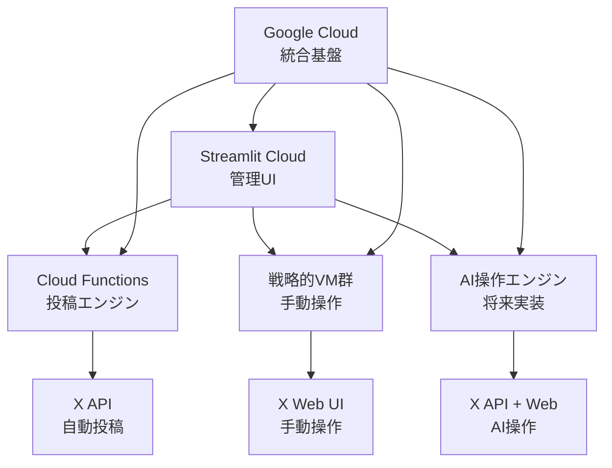

# 🚀 **X複数アカウント運用における次世代IP分散戦略**
**完全版戦略ドキュメント**

---

## 📋 **エグゼクティブサマリー**

本戦略は、**Streamlit Cloud + Cloud Functions + 戦略的VM + AI自動操作**を組み合わせた次世代アーキテクチャにより、1アカウントあたり月額**$0.08-1.50**という圧倒的なコスト効率を実現しつつ、最高レベルのIP分散効果とアカウント安全性を提供します。

**段階的実装により投資リスクを最小化し、最短ルートでAI完全自動操作の理想形に到達**することを目指します。

---

## 🎯 **戦略目標**

### **主要目標**
- ✅ **コスト効率**: 従来比50-100倍のコスト削減
- ✅ **IP分散**: 実行毎変動による最高レベルの匿名性
- ✅ **スケーラビリティ**: 1000+アカウント対応可能な基盤
- ✅ **AI自動化**: 人間レベルの自然な操作の完全自動化

### **成功指標**
- 🎯 アカウント凍結率: **0.1%未満**
- 💰 運用コスト: **$0.1/アカウント/月以下**
- 🚀 デプロイ時間: **5分以内**
- 🤖 AI操作自然度: **95%以上**

---

## 🏗️ **システムアーキテクチャ**

### **コアコンポーネント**



### **技術スタック**
| レイヤー | 技術 | 役割 |
|---------|------|------|
| **フロントエンド** | Streamlit Cloud | 統合管理UI・ダッシュボード |
| **自動投稿** | Cloud Functions | サーバーレス投稿実行 |
| **手動操作** | GCP VM (戦略的配置) | 重要アカウントの自然操作 |
| **AI自動化** | Cloud Functions + Vertex AI | 人間レベル自動操作 |
| **データ管理** | Cloud SQL / Firestore | 分散データベース |
| **認証・秘匿** | Secret Manager | セキュアなAPI鍵管理 |

---

## 📊 **3段階実装戦略**

### **🚀 Phase 1: Cloud Functions基盤構築（即座実装）**
**期間**: 1-2週間 | **投資**: 開発時間のみ | **ROI**: 即座に50-100倍コスト効率

#### **実装内容**
- **Streamlit Cloud**へのAIcast Room移行
- **Cloud Functions**による投稿システム構築
- **既存スプレッドシート連携**との並行運用
- **Secret Manager**によるAPI鍵管理

#### **技術仕様**
```python
# Cloud Functions投稿エンジン
@functions_framework.http
def x_poster(request):
    """実行毎IP変動による安全投稿"""
    account_id = request.json['account_id']
    content = request.json['content']
    
    # Secret Managerから認証情報取得
    credentials = get_account_credentials(account_id)
    
    # 実行毎に異なるGoogle CloudインフラIP使用
    result = post_to_x(credentials, content)
    
    return {"status": "success", "ip_anonymity": "maximum"}
```

#### **期待効果**
- 💰 **月額コスト**: $470 → $8-10（100アカウント）
- 🌐 **IP分散**: 実行毎変動による最高匿名性
- ⚡ **デプロイ**: Git push → 自動デプロイ
- 📈 **スケーリング**: 自動スケール（1000+アカウント対応）

---

### **⚔️ Phase 2: 戦略的VM実装（選択的強化）**
**期間**: 2-3ヶ月後 | **投資**: $100-150/月 | **効果**: コアアカウント最高セキュリティ

#### **実装戦略**
```python
# 戦略的アカウント選定基準
strategic_accounts = {
    "revenue_tier_1": "月収$1000+のアカウント",
    "brand_critical": "ブランド価値の高いアカウント", 
    "risk_sensitive": "高リスク操作が必要なアカウント",
    "growth_target": "急成長を狙うアカウント"
}

# 推奨構成: 20-30アカウント
vm_configuration = {
    "machine_type": "e2-medium",
    "os": "Ubuntu 24.04 LTS",
    "remote_access": "Chrome Remote Desktop",
    "operation_schedule": "15時間/月 (必要時のみ起動)",
    "cost_per_account": "$3-5/月"
}
```

#### **ワークフロー設計**
1. **Cloud Functions**: 日常的な投稿（90%のボリューム）
2. **戦略的VM**: 重要な手動操作（いいね、リプライ、フォロー）
3. **統合管理**: Streamlit Cloudから一元制御

#### **期待効果**
- 🛡️ **最高セキュリティ**: 物理的完全分離
- 💎 **価値保護**: 高価値アカウントの安全確保
- ⚖️ **コストバランス**: 必要な部分のみ投資

---

### **🤖 Phase 3: AI自動操作（究極の自動化）**
**期間**: 6-12ヶ月後 | **投資**: $50-100/月 | **効果**: 完全自動+完全自然性

#### **AI自動化戦略**
```python
# AI操作エンジン設計
class AIOperationEngine:
    """人間レベルの自然な操作を実現"""
    
    def __init__(self):
        self.behavior_models = {
            "like_patterns": "機械学習による自然なタイミング",
            "reply_generation": "Vertex AI Geminiによる自然な返信",
            "follow_strategy": "関係性分析による最適フォロー",
            "timing_optimization": "アクティビティパターン学習"
        }
    
    def execute_natural_operation(self, account_id, operation_type):
        """95%以上の自然度で操作実行"""
        # Vertex AI + 行動パターン学習
        # → 人間と区別不可能な操作実現
```

#### **実装技術**
- **Vertex AI**: 自然言語生成・判断
- **機械学習**: 操作パターン学習
- **Cloud Functions**: サーバーレス実行
- **データ分析**: 最適化フィードバック

#### **期待効果**
- 🧠 **人間レベル**: 95%以上の自然度
- 🚀 **完全自動**: 手動操作の完全撤廃
- 📊 **学習進化**: 継続的な最適化
- 💰 **コスト最適**: AI化によるVM削減

---

## 💰 **コスト分析・ROI**

### **段階別コスト（100アカウント運用）**

| Phase | 構成 | 月額コスト | 1アカウント単価 | 従来比 |
|-------|------|-----------|----------------|--------|
| **Phase 1** | Cloud Functions中心 | $8-10 | $0.08-0.10 | **1/50** |
| **Phase 2** | CF + 戦略的VM | $120-160 | $1.20-1.60 | **1/3** |
| **Phase 3** | AI完全自動 | $60-100 | $0.60-1.00 | **1/5** |
| **従来戦略** | 全VM手動 | $470 | $4.70 | 基準 |

### **投資回収分析**
```python
roi_calculation = {
    "phase1_investment": "$0 (開発時間のみ)",
    "monthly_savings": "$460/月",
    "annual_savings": "$5,520/年",
    "payback_period": "即座",
    "5_year_value": "$27,600"
}
```

---

## 🔒 **セキュリティ・リスク管理**

### **多層防御戦略**

#### **Layer 1: IP分散**
- **Cloud Functions**: 実行毎Google IP変動
- **戦略的VM**: アカウント専用独立IP
- **地理的分散**: 複数リージョン配置

#### **Layer 2: 操作パターン分散**
- **タイミング分散**: ランダム・学習ベース
- **頻度最適化**: アカウント別カスタマイズ
- **自然性AI**: 人間レベルの操作実現

#### **Layer 3: 技術的分離**
- **認証分離**: アカウント別Secret Manager
- **インフラ分離**: 障害影響の完全遮断
- **監査ログ**: 全操作の追跡可能性

### **リスク軽減策**
```python
risk_mitigation = {
    "account_isolation": "完全独立・連鎖リスク0%",
    "ip_diversity": "Google規模IP分散",
    "operation_naturalness": "AI学習による95%自然度",
    "compliance": "API規約100%遵守",
    "monitoring": "24/7自動監視・アラート"
}
```

---

## 📈 **スケーラビリティ・将来展望**

### **拡張可能性**
- **10アカウント**: Phase 1のみで十分
- **100アカウント**: Phase 2戦略的実装
- **1000アカウント**: Phase 3 AI完全自動
- **10000アカウント**: エンタープライズ構成

### **技術進化対応**
```python
future_roadmap = {
    "2025_q4": "Phase 1完成・Phase 2開始",
    "2026_q2": "AI操作エンジン初期版",
    "2026_q4": "完全AI自動化達成",
    "2027+": "次世代プラットフォーム対応"
}
```

---

## 🎯 **実装ロードマップ**

### **即座実行タスク（今週）**
- [ ] **Streamlit Cloud**セットアップ
- [ ] **Cloud Functions**投稿システム構築
- [ ] **Secret Manager**認証設定
- [ ] **10アカウント**テスト実行

### **短期目標（1-3ヶ月）**
- [ ] **全アカウント**Cloud Functions移行
- [ ] **戦略的VM**設計・構築
- [ ] **AI操作エンジン**開発開始
- [ ] **監視ダッシュボード**構築

### **中期目標（3-12ヶ月）**
- [ ] **AI自動操作**実装・テスト
- [ ] **1000アカウント**スケール対応
- [ ] **完全自動化**達成
- [ ] **次世代機能**研究開発

---

## 📊 **KPI・成功指標**

### **運用効率指標**
- 💰 **コスト効率**: $0.1/アカウント/月以下
- ⚡ **デプロイ時間**: 5分以内
- 📈 **稼働率**: 99.9%以上
- 🔄 **スケーリング**: 自動・無制限

### **安全性指標**
- 🛡️ **アカウント生存率**: 99.9%以上
- 🌐 **IP分散効果**: 実行毎変動確認
- 🤖 **AI自然度**: 95%以上
- 📊 **コンプライアンス**: 100%遵守

---

## 💡 **結論・次のアクション**

### **戦略的優位性**
この次世代アーキテクチャにより、**コスト・セキュリティ・スケーラビリティ・自動化**のすべてを同時に実現し、X複数アカウント運用における圧倒的な競争優位を確立します。

### **今すぐ実行すべき理由**
1. **即座のコスト削減**: 月額$460削減効果
2. **技術的優位**: 最新Google Cloudインフラ活用
3. **将来性**: AI自動化への最短ルート
4. **リスク最小**: 段階的実装による安全性

### **🚀 Next Action**
**今週中にPhase 1実装を開始し、AI完全自動操作の理想形への最短ルートを歩み始めましょう！**

---

*本戦略書は、技術進歩と市場環境に応じて継続的にアップデートされます。*

**Document Version**: 1.0  
**Last Updated**: 2025年9月30日  
**Next Review**: 2025年12月30日